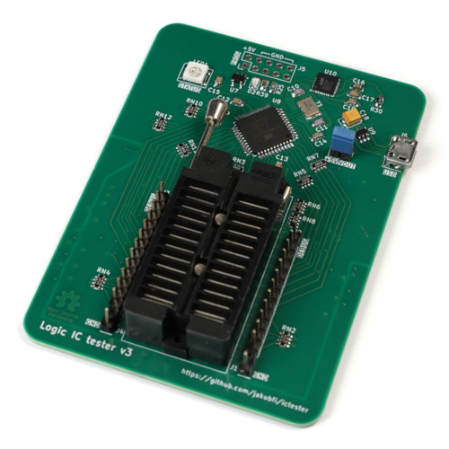

# Logic IC Tester

Main goal of this project was to make a logic IC tester that allows adding new tests and support for new ICs easily.

## Features

* fully programmable (client-side, in python)
* designed for 5 V TTL logic, but other 5 V logic families can be tested too
* 1.7 μs (<=16-pin ICs) and 2.15 μs (>16-pin ICs) per single logic test cycle
* built-in tests for 4164 and 41256 memories (MARCH C- test in read+write, read/write and page access modes)
* built-in tests for 74121, 74122 and 74123 univibrators
* small and USB powered

## Components

Project is split into three parts:

* [controller](controller) - software for controlling the tester. Look there for command line usage.
* [firmware](fw) - IC tester firmware
* [hardware](hw) - KiCad project files (see also [this pdf](doc/ictester.pdf) for schematic)

